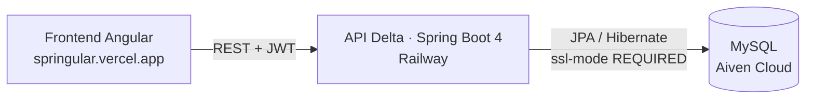

# Delta — API REST de Gestión de Vacunación


API REST que digitaliza el esquema de vacunación ciudadana de punta a punta: los ciudadanos consultan su historial y descargan su **carné digital en PDF**, el personal de salud registra dosis aplicadas y calcula dosis pendientes automáticamente según esquemas de dosificación configurables, y los administradores gestionan el personal y auditan cada acción del sistema.

## 🌐 Demo en vivo

| Componente | URL | Estado |
|---|---|---|
| API REST (este backend) | [backspring-production-4738.up.railway.app](https://backspring-production-4738.up.railway.app) | 🟢 Producción |
| Frontend Angular (repo aparte) | [springular.vercel.app](https://springular.vercel.app) | 🟢 Producción |

## ✨ Características

- **Carné de vacunación digital** — generación de PDF por ciudadano con OpenPDF.
- **Esquemas de dosificación flexibles** — cálculo de próximas dosis mediante **patrón Strategy**: por edad (`CalculoPorEdad`) o por intervalo entre dosis (`CalculoPorIntervalo`).
- **Cálculo automático de dosis pendientes** — el sistema determina refuerzos y siguientes doses según el esquema de cada vacuna.
- **Recordatorios** — generación y seguimiento de recordatorios con estados (`Pendiente` / `Enviado`).
- **Reportes exportables** — vacunaciones en PDF y XLSX (OpenPDF + Apache POI).
- **Seguridad robusta** — autenticación stateless con JWT, contraseñas con **Argon2**, autorización granular por roles con `@PreAuthorize`.
- **Auditoría** — registro de acciones consultable solo por administradores.
- **Manejo global de errores** — excepciones de dominio (`RecursoNoEncontrado`, `RecursoDuplicado`) centralizadas vía `@RestControllerAdvice`.

## 🏛️ Arquitectura



Backend modular organizado por dominio:

| Módulo | Responsabilidad |
|---|---|
| `usuario` | Autenticación, usuarios, ciudadanos, personal de salud, administradores |
| `vacuna` | Catálogo de vacunas, lotes, esquemas de dosificación |
| `vacunacion` | Registro de dosis aplicadas, historial y pendientes |
| `recordatorio` | Generación y ciclo de vida de recordatorios |
| `reporte` | Exportación PDF / XLSX |
| `auditoria` | Trazabilidad de acciones |
| `common.exception` | Manejo global de errores |

La jerarquía de usuarios usa herencia JPA `JOINED` sobre la entidad base `Usuario`, con subclases `Ciudadano`, `PersonalSalud` y `Administrador`.

## 🛠️ Stack tecnológico

| Tecnología | Versión | Uso |
|---|---|---|
| Java | 21 | Lenguaje |
| Spring Boot | 4.1.0 | Framework web (webmvc, data-jpa, security, validation) |
| JJWT | 0.11.5 | Emisión y validación de tokens JWT |
| Spring Security + Argon2 | — | Autenticación y hashing de contraseñas |
| MySQL Connector/J | runtime | Driver de base de datos |
| OpenPDF | 2.0.3 | Carné digital y reportes PDF |
| Apache POI | 5.4.1 | Reportes XLSX |
| BouncyCastle | 1.78.1 | Proveedor criptográfico |
| Lombok | — | Reducción de boilerplate |
| Maven Wrapper | — | Build reproducible sin instalación local |

## 👥 Roles y permisos

| Rol | Puede |
|---|---|
| **ADMINISTRADOR** | Alta/baja y estado del personal de salud, consulta de auditoría |
| **PERSONAL_SALUD** | Registro de ciudadanos y dosis aplicadas, búsqueda por documento, reportes, generación de recordatorios |
| **CIUDADANO** | Su perfil, historial de vacunación, dosis pendientes, descarga de carné digital |

Los endpoints públicos son `/api/auth/**` y `POST /api/usuarios`. Todo lo demás requiere token JWT y verificación de rol tanto a nivel de ruta como de método.

## 🔌 API — Endpoints principales

<details open>
<summary><b>Autenticación</b></summary>

| Método | Ruta | Descripción |
|---|---|---|
| `POST` | `/api/auth/login` | Login, devuelve token JWT |
| `POST` | `/api/usuarios` | Registro público |
| `GET` | `/api/usuarios/me` | Usuario autenticado actual |

</details>

<details>
<summary><b>Ciudadanos</b></summary>

| Método | Ruta | Descripción |
|---|---|---|
| `GET` | `/api/ciudadanos/{id}/perfil` | Perfil del ciudadano |
| `GET` | `/api/ciudadanos/{id}/carne` | Carné digital en PDF |
| `GET` | `/api/personal-salud/ciudadanos` | Listado (PERSONAL_SALUD) |
| `POST` | `/api/personal-salud/ciudadanos` | Crear ciudadano (PERSONAL_SALUD) |
| `GET` | `/api/personal-salud/ciudadanos/documento/{documento}` | Búsqueda por documento |
| `PUT` | `/api/personal-salud/ciudadanos/{id}` | Actualizar ciudadano |

</details>

<details>
<summary><b>Vacunas · lotes · esquemas</b></summary>

| Método | Ruta | Descripción |
|---|---|---|
| `POST` / `GET` | `/api/vacunas` | Crear / listar vacunas |
| `GET` / `PUT` | `/api/vacunas/{id}` | Detalle / actualizar |
| `PATCH` | `/api/vacunas/{id}/estado` | Activar/desactivar |
| `POST` | `/api/vacunas/lotes` | Registrar lote |
| `GET` | `/api/vacunas/{id}/lotes` · `/lotes/todos` | Lotes activos / todos |
| `POST` / `GET` | `/api/vacunas/{id}/esquemas` | Gestionar esquemas de dosificación |
| `DELETE` | `/api/vacunas/esquemas/{idEsquema}` | Eliminar esquema |

</details>

<details>
<summary><b>Vacunación y recordatorios</b></summary>

| Método | Ruta | Descripción |
|---|---|---|
| `POST` | `/api/vacunaciones` | Registrar dosis aplicada (PERSONAL_SALUD) |
| `GET` | `/api/vacunaciones/ciudadano/{id}` | Dosis registradas |
| `GET` | `/api/vacunaciones/ciudadano/{id}/historial` | Historial completo |
| `GET` | `/api/vacunaciones/ciudadano/{id}/pendientes` | Dosis pendientes calculadas |
| `POST` | `/api/recordatorios/generar/{idCiudadano}` | Generar recordatorio según esquema |
| `GET` | `/api/recordatorios` · `/{id}` · `/estado/{estado}` | Consulta de recordatorios |
| `PATCH` | `/api/recordatorios/{id}/enviado` | Marcar como enviado |
| `POST` | `/api/reportes/vacunaciones` | Reporte PDF/XLSX (PERSONAL_SALUD) |
| `GET` | `/api/auditoria` | Log de auditoría (ADMINISTRADOR) |

</details>

<details>
<summary><b>Administración</b></summary>

| Método | Ruta | Descripción |
|---|---|---|
| `GET` / `POST` | `/api/admin/personal-salud` | Listar / crear personal de salud |
| `PUT` | `/api/admin/personal-salud/{id}` | Actualizar |
| `PATCH` | `/api/admin/personal-salud/{id}/estado` | Activar/desactivar |
| `GET` / `PUT` / `DELETE` | `/api/usuarios/{id}` | Gestión de usuarios |

</details>

## ☁️ Despliegue

El backend se despliega en **Railway** desde un Dockerfile multi-stage:

```dockerfile
# Etapa 1: build con Maven + JDK 21
FROM maven:3.9-eclipse-temurin-21 AS build
# mvn clean package -DskipTests

# Etapa 2: runtime ligero JRE 21
FROM eclipse-temurin:21-jre
EXPOSE 8080
```

Variables de entorno requeridas:

| Variable | Ejemplo |
|---|---|
| `DB_URL` | `jdbc:mysql://host:puerto/db?ssl-mode=REQUIRED` |
| `DB_USERNAME` | usuario de la base |
| `DB_PASSWORD` | contraseña de la base |
| `JWT_SECRET` | clave de firma HMAC para tokens |
| `PORT` | puerto HTTP (default `8080`) |

La base de datos MySQL es administrada en **Aiven Cloud** con conexión TLS obligatoria.

## 💻 Ejecución local

**Requisitos:** JDK 21 · MySQL local o remoto · (opcional) Docker

1. Clonar e ingresar:

```bash
git clone https://github.com/itHanslee/backspring.git
cd backspring/Backend/Delta
```

2. Crear la base de datos:

```sql
CREATE DATABASE sistema_vacunacion;
```

3. Configurar credenciales creando `src/main/resources/application-local.properties`
   *(este archivo está en `.gitignore`, nunca se commitea)*:

```properties
DB_URL=jdbc:mysql://localhost:3306/sistema_vacunacion
DB_USERNAME=tu_usuario
DB_PASSWORD=tu_contraseña
JWT_SECRET=una_clave_larga_y_aleatoria
```

> ⚠️ El schema se gestiona fuera de Hibernate (`ddl-auto=none`). Si inicializás una base desde cero, verificá que las claves primarias y foráneas sean `BIGINT` para coincidir con los tipos `Long` del backend.

4. Levantar la API:

```bash
# Windows
mvnw.cmd spring-boot:run

# Linux / macOS
./mvnw spring-boot:run
```

La API queda disponible en `http://localhost:8080`.

## 🤝 Contribución

Sincronizá antes de trabajar y mantené commits atómicos:

```bash
git pull origin main --rebase
git add . && git commit -m "feat: descripción clara" && git push origin main
```

## 📄 Licencia

Este proyecto está bajo la [Licencia MIT](LICENSE).
